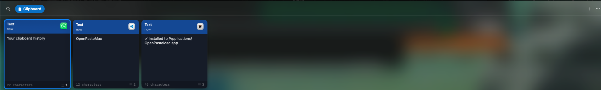

# OpenPasteMac

[](https://github.com/xfajarr/openpastemac)
[](https://swift.org)
[](LICENSE)

A lightweight, open-source clipboard manager for macOS. Native Swift, fast, minimal, keyboard-first.

<p align="center">
  
</p>

## What it does

A fast, lightweight clipboard manager for macOS. Access your clipboard history instantly with a global shortcut, browse items in a shelf-style interface, and paste without switching apps.

### Clipboard History

- **Menu bar app** with a global shortcut (`⌘⇧V`) to open the clipboard shelf
- **Auto-paste** selected items back into the previously active app
- **Supports** text, URLs, images, and files on the clipboard
- **Link previews** for saved URLs with metadata fetching
- **Persistence** — clipboard history is restored across launches via Application Support

### Organization

- **Pinboard** — pin important items for quick access
- **Search** — filter clipboard history in real time
- **Quick select** — paste items 1–9 directly with `⌘1`–`⌘9`

## Install

| Method | Command / Steps |
| --- | --- |
| **Homebrew** | `brew install --cask openpastemac` |
| **Download** | Go to [Releases](https://github.com/xfajarr/openpastemac/releases), download the latest `.dmg`, open it, and drag OpenPasteMac to Applications |
| **Build from source** | `git clone https://github.com/xfajarr/openpastemac.git && cd openpastemac && make install` |

## Permissions

OpenPasteMac requires **Accessibility** access to automatically paste items into other apps.

On first launch, macOS should prompt you. If not:

**System Settings → Privacy & Security → Accessibility**

Without this permission, OpenPasteMac still copies items to the clipboard — you just need to paste manually with `⌘V`.

## Usage

1. Launch OpenPasteMac — it appears in your **menu bar** (top right)
2. Press `⌘⇧V` to open the clipboard shelf
3. Browse recent items with `←` / `→`
4. Press `Enter` to paste the selected item
5. Press `Esc` or click outside to dismiss

### Shortcuts

| Shortcut | Action |
| --- | --- |
| `⌘⇧V` | Toggle clipboard shelf |
| `←` / `→` | Navigate items |
| `Enter` | Paste selected item |
| `⌘1`–`⌘9` | Paste item 1–9 directly |
| `Esc` | Close shelf |

## Development

### Requirements

- macOS 13+
- Xcode Command Line Tools

```bash
xcode-select --install
```

### Build and run

```bash
make run
```

### Make commands

| Command | What it does |
| --- | --- |
| `make build` | Debug build |
| `make run` | Build and launch |
| `make app` | Build the `.app` bundle |
| `make dmg` | Create distributable DMG |
| `make install` | Install to `/Applications` |
| `make uninstall` | Remove from `/Applications` |
| `make clean` | Remove build artifacts |

## Architecture

Native Swift / SwiftUI. No external dependencies.

| Framework | Used for |
| --- | --- |
| AppKit | Menu bar integration, global hotkeys, pasteboard access |
| SwiftUI | Shelf UI, card views, overlays, editing sheets |
| LinkPresentation | URL metadata and link previews |
| ServiceManagement | Launch at Login support |

### Project structure

```text
Sources/
├── main.swift                  # App entry point
├── AppDelegate.swift           # Menu bar, shelf panel, hotkeys, paste behavior
├── ClipboardItem.swift         # Clipboard item model and content types
├── ClipboardMonitor.swift      # Pasteboard change watcher
├── ClipboardStore.swift        # In-memory state, filtering, pinboards, persistence
├── LinkPreviewService.swift    # Async URL metadata fetching
├── Pinboard.swift              # Pinboard data model
├── ShortcutManager.swift       # Global shortcut configuration
├── SourceApp.swift             # Source application tracking
└── Views/
    ├── ClipboardCardView.swift
    ├── ClipboardShelfView.swift
    ├── EditItemSheet.swift
    ├── ItemPreviewOverlay.swift
    ├── PinboardTabBar.swift
    └── VisualEffectView.swift

scripts/
├── build-app.sh               # Builds the .app bundle
└── create-dmg.sh              # Creates distributable DMG
```

## Contributing

Contributions are welcome. See [CONTRIBUTING.md](CONTRIBUTING.md) for setup, project structure, and coding guidelines.

1. Open an issue to discuss a bug or feature idea
2. Fork the repository
3. Create a focused branch
4. Submit a pull request with a clear description

Keep pull requests small, scoped, and easy to review.

## License

MIT. See [LICENSE](LICENSE) for details.
